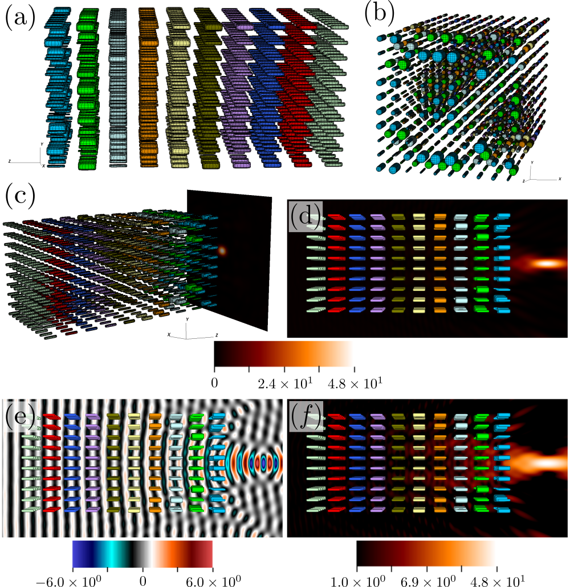
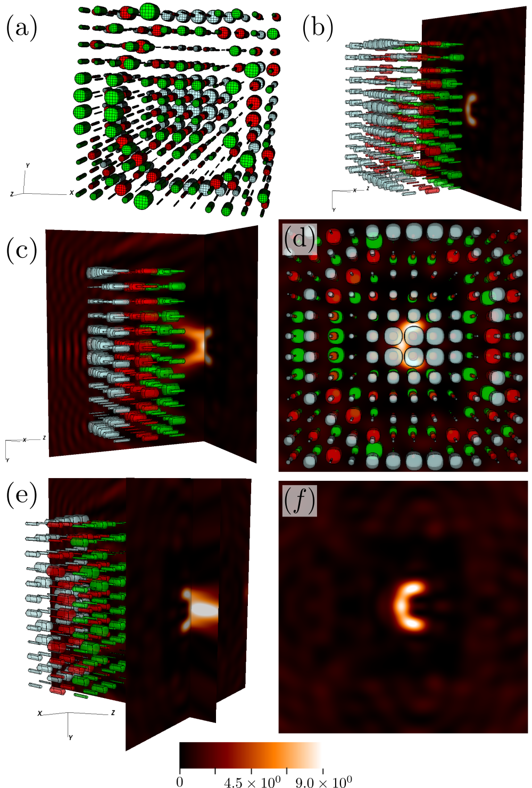
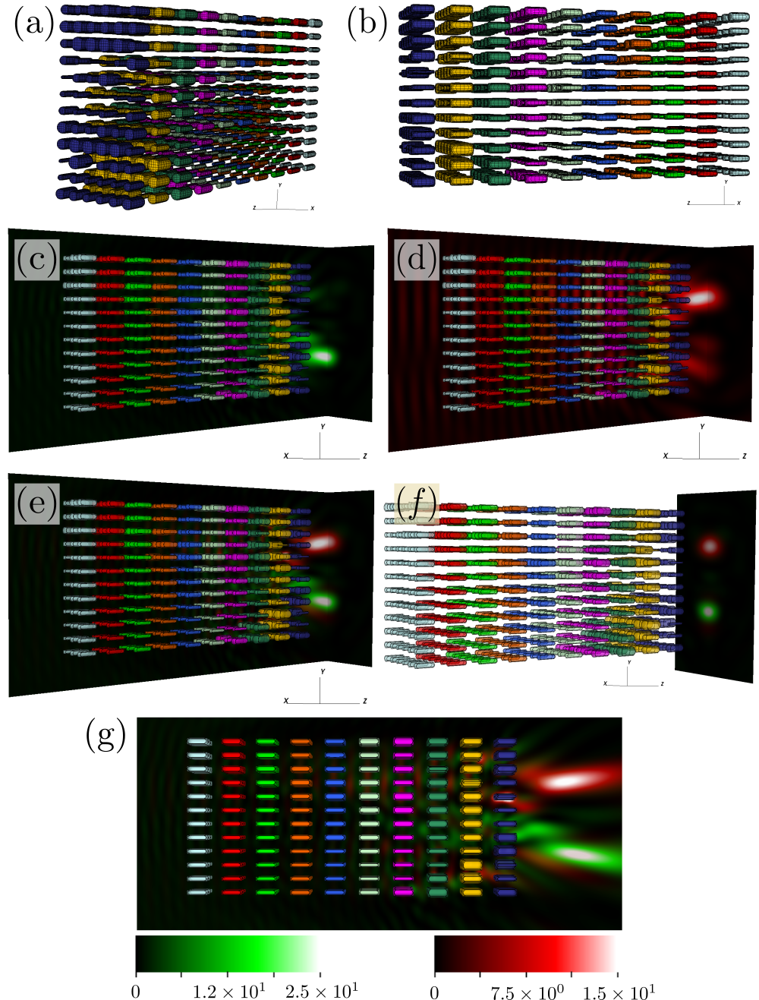

## Wave Scattering in Three-Dimensions Using Boundary Integral Equations
[ArXiv Preprint](https://arxiv.org/abs/1807.01813)

*Three-dimensional scattering by an aircraft using boundary integral equations*

*Scattering by a disk*

## Optimization of Photonic Devices
[PhD Thesis - Chapter 7](https://thesis.library.caltech.edu/13613/)

*Optimized design for a multilayered metalens*

*Metalens designed to focus light in the shape of the letter "C"*

*Optimized metalens designed to split light of two different wavelengths*

## Final Project for Ae 232b CFD (Caltech Winter 2015)

*Flow past a spinning three-lobed structure. Simulation performed using particle and immerse boundary methods.*

## Waveguide Scattering using Boundary Integral Equations
[IEEE Paper](https://ieeexplore.ieee.org/abstract/document/7983012)

*Branching waveguide structure*

*Disk resonator*

*Dielectric horn antenna*

*Illumination of an optical fiber*

## One-way Photonic Waveguide with Magneto-Optical materials

*Finite-Difference Frequency-Domain simulation of a one-way photonic crystal waveguide*
